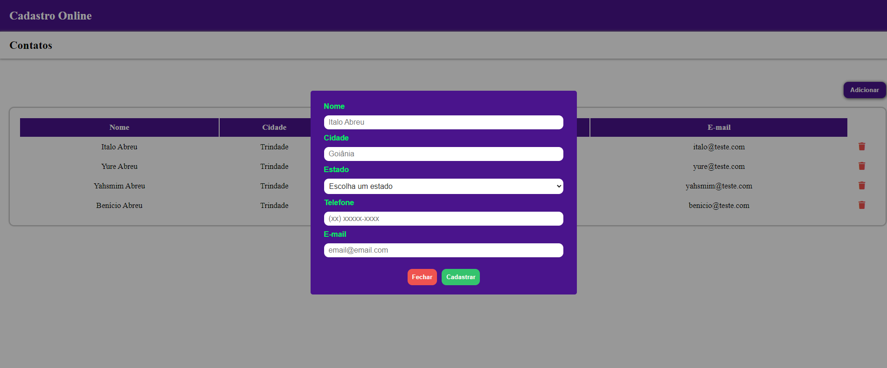

<h1 align="center"> Lista de Tarefas </h1>

  <a href="#-tecnologias">Tecnologias</a>&nbsp;&nbsp;&nbsp;|&nbsp;&nbsp;&nbsp;
  <a href="#-projeto">Projeto</a>&nbsp;&nbsp;&nbsp;

 

  

  

## 🚀 Tecnologias

Esse projeto foi desenvolvido com as seguintes tecnologias:

- JavaScript
- Mongo DB
- HTML e CSS
- Git e Github

## 💻 Projeto

Através do ambiente desenvolvido, armezene seus contatos!  

## 💻 Executar

Para executar o projeto, siga os seguintes passos:

- Clone este repositório
- Abra-o com algum editor de código
- Execute o comando "npm i" (instalar node_modules)
- Execute o comando "npm start"
- Acesse o projeto localmente
